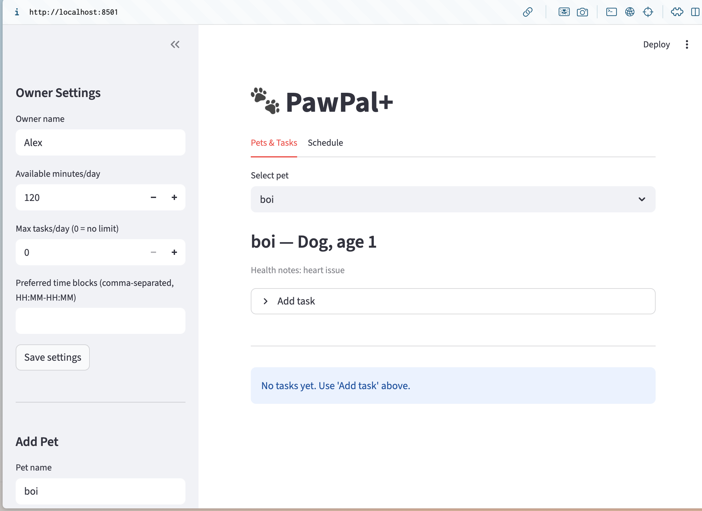
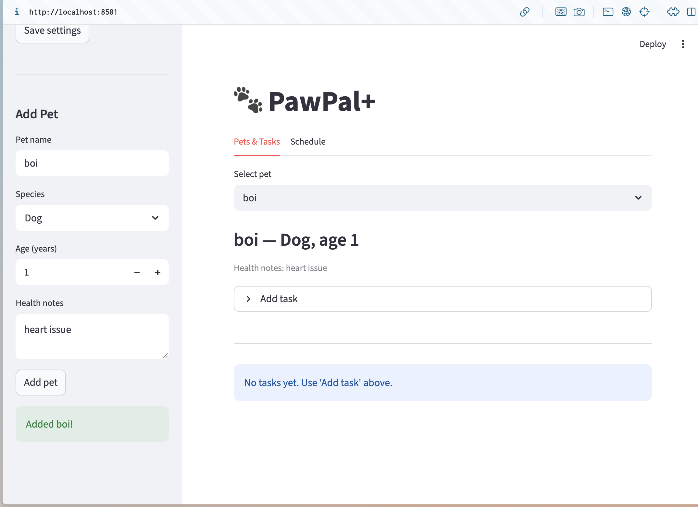

# PawPal+ (Module 2 Project)

You are building **PawPal+**, a Streamlit app that helps a pet owner plan care tasks for their pet.

## Scenario

A busy pet owner needs help staying consistent with pet care. They want an assistant that can:

- Track pet care tasks (walks, feeding, meds, enrichment, grooming, etc.)
- Consider constraints (time available, priority, owner preferences)
- Produce a daily plan and explain why it chose that plan

Your job is to design the system first (UML), then implement the logic in Python, then connect it to the Streamlit UI.

## What you will build

Your final app should:

- Let a user enter basic owner + pet info
- Let a user add/edit tasks (duration + priority at minimum)
- Generate a daily schedule/plan based on constraints and priorities
- Display the plan clearly (and ideally explain the reasoning)
- Include tests for the most important scheduling behaviors

## Getting started

### Setup

```bash
python -m venv .venv
source .venv/bin/activate  # Windows: .venv\Scripts\activate
pip install -r requirements.txt
```

### Suggested workflow

1. Read the scenario carefully and identify requirements and edge cases.
2. Draft a UML diagram (classes, attributes, methods, relationships).
3. Convert UML into Python class stubs (no logic yet).
4. Implement scheduling logic in small increments.
5. Add tests to verify key behaviors.
6. Connect your logic to the Streamlit UI in `app.py`.
7. Refine UML so it matches what you actually built.

# 🐾 PawPal Task Scheduler

## 🚀 Features

### 🗓️ Task Scheduling & Recurrence
- **Daily, Weekly, and One-Time Tasks**
  - Automatically determines if a task is due based on recurrence rules.
- **Automatic Next Occurrence Generation**
  - Recurring tasks generate their next instance upon completion.
- **Per-Day Completion Tracking**
  - Ensures recurring tasks reappear correctly on future dates.

### ⚡ Priority & Urgency Scoring
- **Priority-Based Ranking**
  - Supports `low`, `medium`, and `high` priority levels.
- **Required Task Boost**
  - Required tasks are always prioritized higher.
- **Time-Aware Urgency Calculation**
  - Increases urgency when:
    - Task is within its due window
    - Task is overdue
    - Task is approaching its scheduled time

### ⏰ Time Window Handling
- **Due Window Parsing**
  - Supports time ranges (e.g., `09:00-11:00`) converted into minutes.
- **Window-Based Urgency Adjustment**
  - Tasks gain urgency based on proximity to their time window.
- **Graceful Error Handling**
  - Invalid time formats are ignored safely.

### 🧠 Task Selection Algorithm
- **Multi-Criteria Ranking**
  Tasks are sorted by:
  1. Required status
  2. Urgency score
  3. Duration (shorter tasks preferred)
  4. Title (tie-breaker)
- **Greedy Time Allocation**
  - Selects tasks sequentially until available time is used up.
- **Daily Time Constraints**
  - Ensures total scheduled time does not exceed availability.

### ⚠️ Conflict Detection
- **Overlap Detection**
  - Identifies tasks with overlapping time windows.
- **Conflict Reporting**
  - Returns pairs of conflicting tasks.
- **User-Friendly Warnings**
  - Generates readable conflict messages.

### 🔍 Task Filtering & Querying
- **Filter by Completion Status**
  - Supports both global and per-day completion views.
- **Filter by Pet**
  - Retrieve tasks for a specific pet.
- **Date-Based Queries**
  - View only tasks due on a specific date.
- **Required Task Extraction**
  - Quickly identify must-do tasks.

### 📊 Sorting & Organization
- **Sort by Time Window**
  - Orders tasks by earliest start time.
- **Stable Multi-Key Sorting**
  - Ensures consistent and predictable ordering.

### 👤 Owner Constraints & Preferences
- **Daily Availability Limit**
  - Caps total minutes available per day.
- **Maximum Tasks Per Day**
  - Limits number of scheduled tasks.
- **Preferred Time Blocks**
  - Stores user preferences for future scheduling improvements.

### 📅 Plan Generation & Explanation
- **Automated Daily Planning**
  - Generates an optimized schedule of tasks.
- **Unscheduled Task Tracking**
  - Clearly shows deferred tasks.
- **Explanation Engine**
  - Provides:
    - Reason for task selection
    - Deferred task explanation
    - Time usage summary
    - Conflict details


### ✅ Data Integrity & Validation
- **Input Validation**
  - Prevents invalid priorities and negative values.
- **Duplicate Prevention**
  - Avoids duplicate tasks and pets.
- **Safe Defaults**
  - Handles missing or malformed data gracefully.


## 🛠️ Tech Stack
- Python 3
- `dataclasses`
- Standard Library (`datetime`, `typing`)


## 📸 Demo

| Owner Setup | Pet & Tasks |
|---|---|
|  |  |